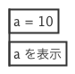
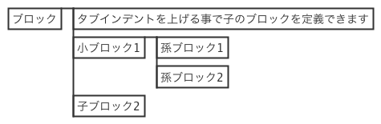
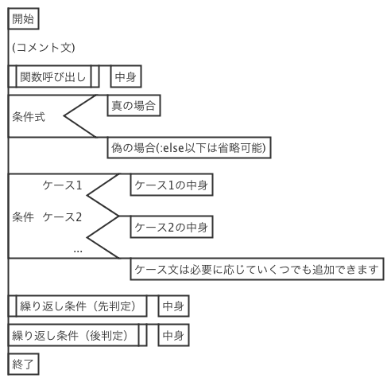

PadTools 1.4
***********

.. image:: images/ss.jpg

概要
====
PadTools はPAD図を活用することを目的としています。
思考を止めず記述できることを目指しています。

動作環境
========
1. Windows10 JRE8

上記の環境で動作を確認しております。
その他環境でも、JRE8が動作するOSであれば動作する可能性がありますが、
上記環境以外では動作確認をおこなっておりません。

利用法
======

SPD(Simple PAD Description)文法
--------------------------------
PadToolsではロジックを記述する際に SPDフォーマットを使用します。
本節では、SPDフォーマットの文法について説明を行います。

ブロック
^^^^^^^
1行がPADの１ボックスと対応します。
ただし、空白行や「#」(シャープ)から始まる行は読み飛ばします。

例::

    #コメント
    a = 10
    a を表示
    
↓（PADへ変換）

ブロック内の改行
^^^^^^^^^^^^^^

文中に「@」(アットマーク)を使用した場合、改行文字として扱われます。
文末に「@」が現れた場合は、改行を行うとともに、
次の行も含めてPADの１ボックスを作成します。

例1::

     a = 10
     a を表示@標準エラー出力に出力
     a = 0

↓（PADへ変換）

.. image:: images/format_basic_02.png

例2::

     a = 10
     a を表示@
     標準エラー出力に出力
     a = 0

↓（PADへ変換）

.. image:: images/format_basic_02.png

親子関係
^^^^^^^^
タブ文字でインデントをつけることで、 ブロックの親子関係を記述できます。

例::

     ブロック
         タブインデントを上げる事で子のブロックを定義できます
         小ブロック1
             孫ブロック1
             孫ブロック2
         子ブロック2

↓（PADへ変換）

命令文(:if, :while, ...)
^^^^^^^^^^^^^^^^^^^^^^^^
条件分岐や繰返し文など、特別なボックスを作成するには、
「:」(コロン)から始まる命令文を使用します。

.. note::
    文頭で「:」を使用した場合のみ命令文と認識されます。
    文中で「:」を使用した場合は、命令文ではなく通常の文字として扱われます。

PadTools では以下の命令文が定義されています。

* :comment … コメントを定義する
* :terminal … 端子を定義する
* :call … 関数呼び出しを定義する
* :if … 条件分岐（真／偽）を定義する
* :else … :if と組み合わせて使用し、偽の場合を定義する
* :switch … 条件分岐（任意のケース）を定義する
* :case … :switch と組み合わせて使用し、指定のケースを定義する
* :while … 前判定の繰り返し処理を定義する
* :dowhile … 後判定の繰り返し処理を定義する

例::

     開始
     :comment コメント文
     :call 関数呼び出し
        中身
     :if 条件式
         真の場合
     :else
         偽の場合(:else以下は省略可能)
     :switch 条件
     :case ケース1
         ケース1の中身
     :case ケース2
         ケース2の中身
     :case ...
         ケース文は必要に応じていくつでも追加できます
     :while 繰り返し条件（先判定）
         中身
     :dowhile 繰り返し条件（後判定）
         中身
     終了

↓（PADへ変換）

ダウンロード
===========

`PadTools Guthub Releases <https://github.com/knaou/padtools/releases>`_

ライセンス
==========

| Copyright (c) 2015-2018 naou
| Released under the MIT license(`http://opensource.org/licenses/mit-license`_)

リンク
=====
* GitHub <https://github.com/knaou/padtools>
* naou.cool-ex.com <https://naou.cool-ex.com>
